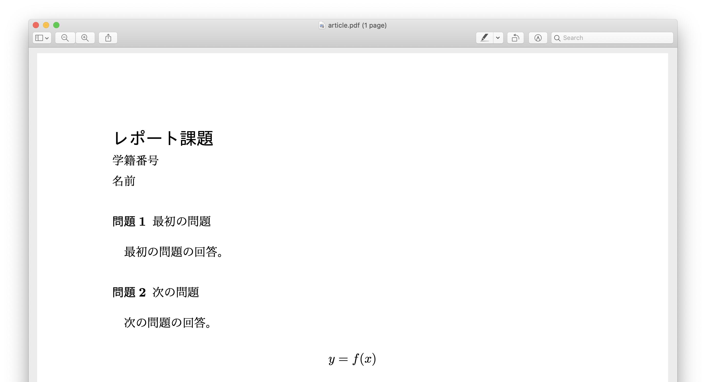

## 短いレポート
私が普段短いレポート課題を提出するときに使う設定をまとめたボイラープレートです。

```latex
\documentclass[12pt,a4j]{ltjsarticle}
\usepackage{amsmath,amssymb}
\usepackage{luatexja}
\usepackage{enumitem}
\usepackage{titlesec}

\pagestyle{plain}
\setlength{\textheight}{\paperheight}
\setlength{\topmargin}{-0.4truemm}
\addtolength{\topmargin}{-\headheight} 
\addtolength{\topmargin}{-\headsep}
\addtolength{\textheight}{-50truemm}
\setlength{\textwidth}{\paperwidth}
\setlength{\oddsidemargin}{-0.4truemm}
\setlength{\evensidemargin}{-0.4truemm}
\addtolength{\textwidth}{-50truemm}

\titleformat{\section}[block]{\normalsize}{\textbf{問題\thesection}}{0.5em}{}

\begin{document}
{\bfseries\noindent\Large レポート課題}

\noindent 学籍番号\\
名前

\section{最初の問題}

最初の問題の回答。

\section{次の問題}

次の問題の回答。

\[
	y = f(x) % 適当な数式
\]

\end{document}
```

このファイルを出力すると、次のような結果が得られます。


