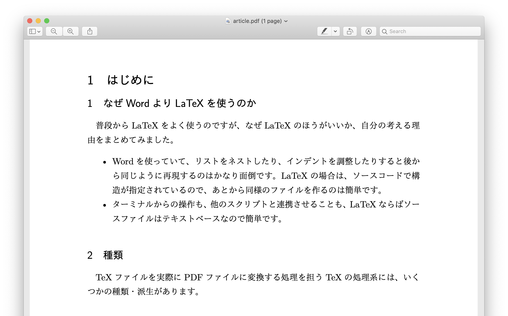
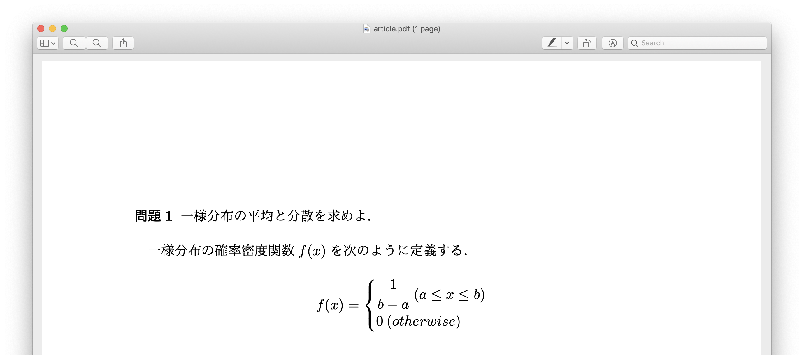

## 見出し

見出しのスタイルを変更したい時には、`\renewcommand`コマンドを使うことができます。ためしに次の行をプリアンブルに追加してみましょう。

```
\renewcommand{\thesubsection}{\arabic{subsection}}
```

これによって通常1.1などと表示される`subsection`の見出しに`section`の番号(1.1の1.の部分)を表示させないようにすることができます。

`\renewcommand`に続く最初の`{}`で`\the`を追加した見出しの種類を記述し、どの見出しのスタイルを変更するかを指定します。続く`{}`で、実際の書式を設定します。例の`\arabic`だけでなく、次のオプションがあります。

|コマンド|形式|例|
|---|---|---|
|`\arabic`|アラビア数字|1, 2, 3, ...|
|`\roman`|ローマ数字|ⅰ, ⅱ, ⅲ, ...|
|`\Roman`|ローマ数字|Ⅰ, Ⅱ, Ⅲ, ...|
|`\alph`|アルファベット|a, b, c, ...|
|`\Alph`|アルファベット|A, B, C, ...|

`\arabic`などのコマンドに囲まれた部分にはカウンタを指定します。カウンタとはTeXで見出しの番号が入っている変数のようなものです。見出しのタイプを指定することができます。

さきほどの例を見てみましょう。

```latex
\documentclass[12pt,a4j]{ltjsarticle}
\usepackage{luatexja}
\renewcommand{\thesubsection}{\arabic{subsection}}

\begin{document}

\section{はじめに}

\subsection{なぜWordよりLaTeXを使うのか}

普段からLaTeXをよく使うのですが、なぜLaTeXのほうがいいか、自分の考える理由をまとめてみました。

\begin{itemize}
\item Wordを使っていて、リストをネストしたり、インデントを調整したりすると後から同じように再現するのはかなり面倒です。LaTeXの場合は、ソースコードで構造が指定されているので、あとから同様のファイルを作るのは簡単です。
\item ターミナルからの操作も、他のスクリプトと連携させることも、LaTeXならばソースファイルはテキストベースなので簡単です。
\end{itemize}

\subsection{種類}

TeXファイルを実際にPDFファイルに変換する処理を担うTeXの処理系には、いくつかの種類・派生があります。

\end{document}
```

このようなドキュメントを作成し、PDFを出力すると、次のような結果が得られます。`subsection`は本来`1.1`のように、`section`の番号も入りますが、`\renewcommand` を用いたことによって、その表示を消すことができました。



## 見出し – 高度なカスタマイズ

より高度な見出しのカスタマイズを行うためには、`titlesec`パッケージを利用することができます。このパッケージを使うのが初めての場合は、ターミナルで

```bash
sudo tlmgr install titlesec
```

を実行してパッケージをインストールします。その後、プリアンブルにカスタマイズする見出しの設定を記述します。

```latex
\usepackage{titlesec}
\titleformat{\section}[block]{\normalsize}{\textbf{問題\thesection}}{0.5em}{}
```

上の例では、`section`の見出しを変更して、問題文の表示に使っています。

この例を含むソースファイル

```latex
\documentclass[12pt,a4j]{ltjsarticle}
\usepackage{luatexja}
\usepackage{amsmath,amssymb} % 数式表示のため
\usepackage{titlesec}

\titleformat{\section}[block]{\normalsize}{\textbf{問題\thesection}}{0.5em}{}

\begin{document}

\section{一様分布の平均と分散を求めよ． }

一様分布の確率密度関数\( f(x) \)を次のように定義する．

\[
f(x)= \left\{
	\begin{aligned}
		&\frac{1}{b-a} \: (a \leq x \leq b) \\
		& 0 \: (otherwise)
	\end{aligned}
\right.
\]

% 以下略

\section{}
\end{document}
```
からPDFを出力すると、つぎのような結果が得られます。



## 箇条書き

箇条書きのスタイルを変更するには、`enumitem` を使うことができます。このパッケージを用いることで、見出しの行頭文字や、マージンを変更することが可能です。

プリアンブルに

```latex
\usepackage{enumitem}
```

を指定した上で、箇条書きを

```latex
\begin{enumerate}[label=\textbf{\alph*}]
\item 項目
\item 項目
\item 項目
\end{enumerate}
```

のように記述します。この場合の出力結果は、次のようになります。


