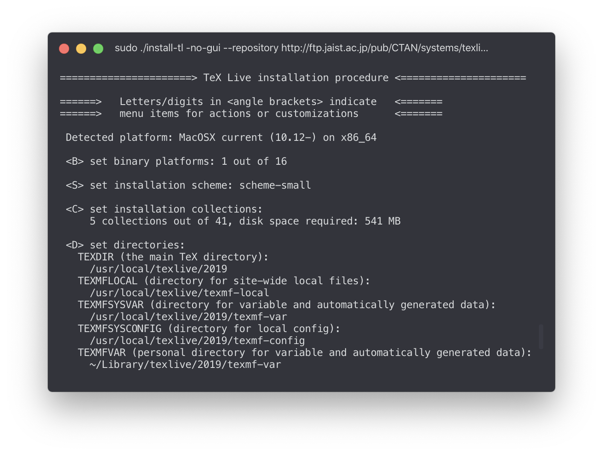

## はじめに

LaTeXを使い始めるのに必要なのは、

- TeXのソースファイル
- それを処理する任意のTeX処理系

多くのチュートリアルでは、LaTeXの統合環境をインストールすることをすすめますが、統合環境を入れることは必須ではなく、自分の好きなエディタと、TeX処理系だけで十分に対応できます。むしろ、このようにミニマルなセットアップのほうが、ディスク容量を不必要に消費することもなく、また、普段使い慣れたエディタで作業しやすいと思います。

## Linux

### 概要

Linuxでは、各ディストリビューションのパッケージマネージャ(ex. `yum`, `apt`)が提供しているLaTeXのパッケージを利用することもできますが、LaTeXの各種設定を変更できるパッケージを管理・利用する都合上、TeX Liveを使うことをおすすめします。TeX Liveを使うことによって、`tlmgr`でTeXのパッケージを管理することができます。

以降では、Arch Linuxを例に説明しますが、ほかのディストリビューションでも、概ね同じ方法でインストールが可能です。

### 下準備 – TeX関連のパッケージをpacmanの管理下からはず。

今回は、Linuxのパッケージ管理ツールではなく、TeX Liveを用いてLaTeXのインストールを行ます。その場合、パッケージマネージャとTeX Liveが干渉してしまうため、TeX関連のパッケージについてはOSのパッケージマネージャに管理されないようにする必要があります。[TeX Wiki](https://texwiki.texjp.org/?texlive-dummy#archlinux)によると、

> Linux で TeX Live 公式パッケージをインストールした場合は TeX Live に依存するパッケージによって各種 Linux ディストリビューションが提供している TeX Live がインストールされないように TeX Live の dummy パッケージをインストールします。

dummyパッケージというもの導入することによってTeX関連のパッケージがpacmanに管理されないようにするという方法が紹介されています。ですが、dummyパッケージについてはあまりきれいな解決方法ではないため、議論が起き現在はAURから削除されているようです。そこで、`pacman --assume-installed`を使ってを解決してみました。

[texlive-dummyのソースコード](https://github.com/zhou13/aur/blob/master/texlive-dummy/PKGBUILD)を見てみると、

```:PKGBUILD
conflicts=('texlive-bin' $(pacman -Sgq texlive-most texlive-lang))
provides=('texlive-bin' $(pacman -Sgq texlive-most texlive-lang))
```
この部分で調整しているようなので、texlive関連のパッケージが常にpacmanに無視されるように以下を`~/.bashrc`に追加しました。

```
alias pacman="pacman --assume-installed texlive-bin $(\pacman -Sgq texlive-most texlive-lang)"
```
読み込むために一度ターミナルで`$ source ~/.bashrc`を実行します。
この操作によってpacmanとコンフリクトしないようになりました。

### インストーラの実行

インストーラをダウンロードして実行します。

```bash
curl -OL http://mirror.ctan.org/systems/texlive/tlnet/install-tl-unx.tar.gz
tar xvf install-tl-unx.tar.gz
cd install-tl-20*
sudo ./install-tl -no-gui --repository http://ftp.jaist.ac.jp/pub/CTAN/systems/texlive/tlnet/
```

インストーラにしたがって、オプションを選択します。普段使っているMacのBasicTeXに準じている`small scheme`を選びました。他のオプションはそのままでインストールします。

インストーラの動作が終了したらしたら、パスを通して、日本語環境とghostscriptをインストールします。

```bash
sudo /usr/local/texlive/????/bin/*/tlmgr path add
sudo tlmgr update --self -all
sudo tlmgr install collection-langjapanese
sudo pacman -S ghostscript
```

以上でインストールは完了です！


## macOS

### 概要

`MacTeX`の使う例が多いですが、ここでは、Linuxの場合同様にTeX Liveを使ってインストールを進めます。

### インストーラの実行

Linuxと同様にインストールをダウンロードして、実行します。

```bash
curl -OL http://mirror.ctan.org/systems/texlive/tlnet/install-tl-unx.tar.gz
tar xvf install-tl-unx.tar.gz
cd install-tl-20*
sudo ./install-tl -no-gui --repository http://ftp.jaist.ac.jp/pub/CTAN/systems/texlive/tlnet/
```

インストーラにしたがって、オプションを選択します。MacのBasicTeXに準じている`small scheme`を選びました。他のオプションはそのままでインストールします。



インストーラの動作が終了したらしたら、パスを通して、日本語環境とインストールして完了です。

```bash
sudo /usr/local/texlive/????/bin/*/tlmgr path add
sudo tlmgr update --self -all
sudo tlmgr install collection-langjapanese
```


## TeX Live Manager `tlmgr`を使う

インストールが完了すると、TeXで使うパッケージの管理ツール`tlmgr`使えるようになります。これを使うことで、パッケージの追加やアップデートを行うことができます。

TeXのソースファイルでは、ヘッダーに

```latex
\usepackage{enumitem}
```

のように、パッケージを読み込む記述を追加する場合があります。これを行ったのちに、コマンドの実行時に次のようなエラーが発生した場合、

```
! LaTeX Error: File `enumitem.sty' not found.

Type X to quit or <RETURN> to proceed,
or enter new name. (Default extension: sty)
```

必要なパッケージがインストールされていないので、

```bash
sudo tlmgr install enumitem
```

のようにして、パッケージを追加することによって、エラーを回避できます。

---

### 参考

- [Linux - TeX Wiki](https://texwiki.texjp.org/?Linux#texliveinstall)
- [TeX Live/Mac - TeX Wiki](https://texwiki.texjp.org/?TeX%20Live%2FMac#texlive-install-official)
