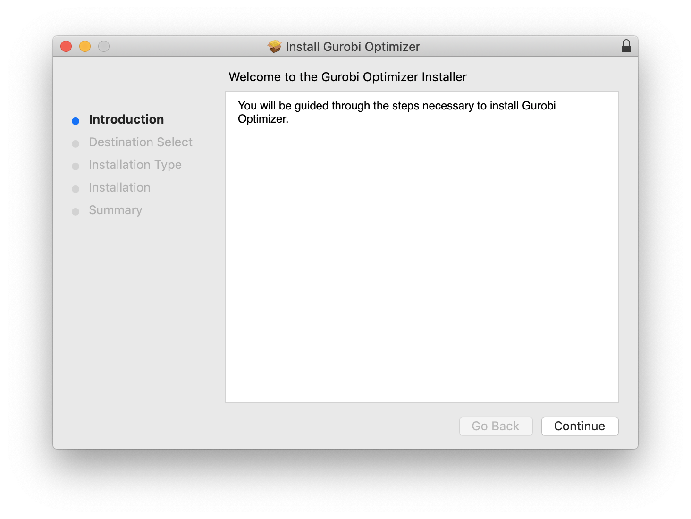

## これは何

MacでGurobiのダウンロード・インストール・アカデミックライセンスを有効化する方法をまとめたメモです．最後に動作確認のためGurobi + Pythonで簡単な最適化問題を解きました．

## 環境

- macOS 10.14.6
- Python 3.8.2 (pyenvでインストールした状態)
- pip（宗教上の理由でanacondaは使えないので）
- インストールするGurobi: v9.0

## Gurobiのセットアップ

### 公式サイトに登録

https://pages.gurobi.com/registration からGurobiのアカウントを発行できます．`Academic` をプルダウンから選択した上で，メールアドレスには `.ac.jp` ドメインのものを設定しました．


指定したメールアドレスにパスワード設定用のリンクを含むメールが飛んできます．パスワードを設定したら https://www.gurobi.com/account/ にログインします．

### ライセンスの発行

Gurobiの公式サイトにログインできたら，右上のメニューより，`Download & Licenses` > `Academic License` を選択するか https://www.gurobi.com/downloads/end-user-license-agreement-academic/ にアクセスすることでアカデミックライセンスを発行できます．同意するとすぐにライセンスが発行されます．


### ダウンロード

http://www.gurobi.com/downloads/gurobi-optimizer からダウンロードできます．macOS用の `.pkg` ファイルをダウンロードして，実行します．



### ライセンスの有効化

https://www.gurobi.com/downloads/licenses/ にさきほど発行したライセンスがあるので，License IDをクリックして詳細画面に移動します．ページの下のほうに`grbgetkey`からはじまるコマンドが記載されているので，これをそのままコピーしてターミナルで実行します．

### 動作確認

ターミナルで

```bash
gurobi.sh
```

を実行して，Gurobiのインタラクティブシェルが問題なく起動することを確認します．

### Pythonスクリプト内でインポートして使えるようにする

Gurobi自体にもPythonのランタイムは付属しており，`gurobi.sh your-file-name.py` といった形で実行したり，Gurobiのインタラクティブシェルだけを使っている分にはなにもしなくていいのですが，自分で用意したPython環境内でGurobiを使いたいので次の手順を実行しました．

はじめに次のコマンドを実行してGurobiがインストールされているディレクトリを探します．

```bash
readlink `which gurobi.sh`
```

`//Library/gurobi901/mac64/bin/gurobi.sh` のような出力が得られるので，`bin/gurobi.sh` 以前の部分のパスに移動します．

```bash
cd /Library/gurobi901/mac64
```

最後に次のコマンドを実行して，自分で用意したPython環境内にGurobiのライブラリを追加します．

```bash
python setup.py install
```

問題なく追加できた場合，`pip list` を実行すると `gurobipy` が一覧に含まれているの確認できます．

## 試しに簡単な最適化問題を解く

久保 幹雄，ジョア・ペドロ・ペドロソ，村松 正和，アブドル・レイス『あたらしい数理最適化: Python言語とGurobiで解く』より，1章2節の線形計画問題を解いてみます．

$$
\begin{array}{crc}
\text{maximize} & 15 x_1 + 18 x_2 + 30 x_3 & \\
\text{subject to} & 2 x_1 + x_2 + x_3 &\leq 60 \\
& x_1 + 2x_2 + x_3 &\leq 60 \\
& x_3 &\leq 30 \\
& x_1, x_2, x_3 &\geq 0
\end{array}
$$

ほとんど本のサンプルコードの通りですが，次のコードを書きました．

```python
from gurobipy import *
model = Model("lo1")

x1 = model.addVar(name="x1")
x2 = model.addVar(name="x2")
x3 = model.addVar(name="x3")

model.update()
model.addConstr(2 * x1 + x2 + x3 <= 60)
model.addConstr(x1 + 2 * x2 + x3 <= 60)
model.addConstr(x3 <= 30)

model.setObjective(15 * x1 + 18 * x2 + 30 * x3, GRB.MAXIMIZE)

model.optimize()

print("Opt, Value =", model.ObjVal)
for v in model.getVars():
    print(v.VarName, v.X)
```

これを実行すると次の通りの結果が得られて，Gurobi + Pythonのセットアップのセットアップが問題なく動作することを確認できました．

```
Gurobi Optimizer version 9.0.1 build v9.0.1rc0 (mac64)
Optimize a model with 3 rows, 3 columns and 7 nonzeros
Model fingerprint: 0x33f633c8
Coefficient statistics:
  Matrix range     [1e+00, 2e+00]
  Objective range  [2e+01, 3e+01]
  Bounds range     [0e+00, 0e+00]
  RHS range        [3e+01, 6e+01]
Presolve removed 1 rows and 0 columns
Presolve time: 0.01s
Presolved: 2 rows, 3 columns, 6 nonzeros

Iteration    Objective       Primal Inf.    Dual Inf.      Time
       0    1.8000000e+03   3.750000e+00   0.000000e+00      0s
       2    1.2300000e+03   0.000000e+00   0.000000e+00      0s

Solved in 2 iterations and 0.02 seconds
Optimal objective  1.230000000e+03
Opt, Value = 1230.0
x1 10.0
x2 10.0
x3 30.0
```
