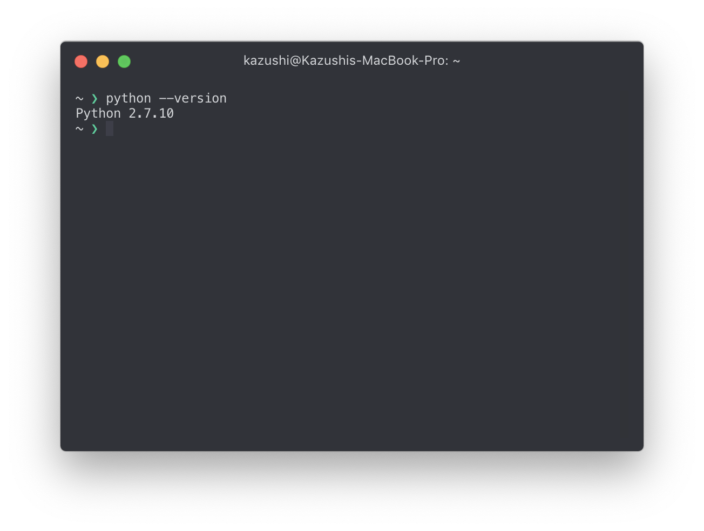

## TL;DR

普段はNode.jsで開発しているのですが，Pythonでもいい感じにプロジェクトをセットアップできるように，Pythonの各種ツール類やセットアップ方法をまとめた個人的なメモです．情報の正確さには気をつけましたが，Pythonエキスパートではないので間違った認識があるかもしれません．🙇‍適宜Node.jsのツールと比較してみました．

長すぎて読めないという人のためにざっくりとまとめると，

- Pythonのバージョンはpyenvで切り替え
- Anacondaを使いたくない
- Globalに使うPython製のアプリはpipxでインストール
- プロジェクトのdependencyはPoetryで管理
- コードの治安はflake8とautopep8で維持する

という感じの内容になっています．この記事は[My Python Development Environment, 2020 Edition](https://jacobian.org/2019/nov/11/python-environment-2020/)をかなり参考にしています．

## Pythonのインストールとバージョン管理

はじめにmacOSに標準でインストールされているPythonのバージョンを確認してみましょう．



古くてつらいので，別途Pythonをインストールします．HomebrewからPythonを直接インストールすることもできますが，プロジェクトによって使い分けるためにもPython自体のバージョンを切り替えるツールを使います．Node.jsの`nvm`やRubyの`rbenv`と同様です．

[pyenv](https://github.com/pyenv/pyenv) がデファクトスタンダードなようなので，ここではpyenvを使ってバージョン管理を行います．

### インストール

```bash
brew install pyenv
```

インストールが終わったら，`~/.bashrc` なり `~/.zshrc` なりに次の内容を追加します．

```bash
if which pyenv > /dev/null; then
    eval "$(pyenv init -)";
fi
```

### バージョンのインストールと切り替え

任意のバージョンを次のようにしてインストールできます．　

```bash
pyenv install 3.8.1 ##インストール
pyenv global 3.8.1 ## デフォルトで使用するバージョンの切り替え　
```

## Anacondaを使わない

標準で使えるpip以外に，Anacondaというパッケージマネージャ・仮想環境管理ツールを含むPythonのディストリビューションがあります．

> Anaconda® is a package manager, an environment manager, a Python/R data science distribution, and a collection of over 7,500+ open-source packages. Anaconda is free and easy to install, and it offers free community support. [^quote]

[^quote]: https://docs.anaconda.com/anaconda/

こちらは機械学習はデータサイエンスを目的にPythonを使う人たちの間ではよく使用されます．最初からmatplotlibやpandas，Jupyterなどデータ分析に必要なライブラリ，ツールが一通り揃っているため，なにも考えずにデータ分析など作業を開始できます．

付属するcondaというパッケージマネージャでは標準のパッケージのフォーマットとは異なるフォーマットが採用されており，condaとpipのパッケージには互換性がありません．しかし，condaが参照するライブラリのリポジトリにも上記の通り十分なライブラリが揃っているため，普通につかう分には問題ないです．

AnacondaにはPython以外で書かれたライブラリやバイナリも含めて統合的に扱いたいという思想があり，[^philosophy] 公式リポジトリではないですが，コミュニティリポジトリからはNode.jsまでインストールできてしまいます．[^conda-node]

[^philosophy]: https://stackoverflow.com/questions/20994716/what-is-the-difference-between-pip-and-conda また併せて，[こちらのアーカイブ](http://web.archive.org/web/20170415041123/www.continuum.io/blog/developer-blog/python-packages-and-environments-conda)も参照されたし

[^conda-node]: https://anaconda.org/conda-forge/nodejs

また，pipをfreezeして生成する `requirements.txt` はトップレベルの依存性と，ライブラリの依存性をすべて並列にならべるだけでつらい[^better-pip]ので，依存ツリーを管理してくれるAnacondaはこの点も人気に影響したようです．

[^better-pip]: つらさを解消しようとした例 https://www.kennethreitz.org/essays/a-better-pip-workflow

しかし，以下の理由から，現在はわざわざAnacondaを採用する必要はないと感じました．

- Anaconda自体が全部盛りなのでディスク容量をめっちゃ消費する
- anacondaのリポジトリに登録されていないライブラリを使うにはpipと併用する必要があり，両方使おうとするとコンフリクトが発生してつらい場合がある
- `requirements.txt` による依存性管理の問題も別途ツールをを使うことで解消できる（後述）
- pipも[wheel](https://www.python.org/dev/peps/pep-0427/) によってバイナリを扱えるようになった
- pandasなどのライブラリを，プロジェクトベースでバージョンを管理してインストールするのではなく，システムワイドなインストールを参照するのはいかがなのか🤔
- node.jsまでインストールできてしまうcondaの思想が気に入らない（）

なので，このガイドではAnacondaを使用しません．

## Python製アプリケーションのインストール

pipで公開されているパッケージのなかには，Pythonのスクリプト内でインポートして使えるライブラリだけでなく，PATHが通った実行可能なコマンドをインストールするものもあります．httpieやJupyter Notebookなど，これらのパッケージをpipで直接インストールしてしまうと，すぐに`pip list`の結果が膨れ上がります．実際問題，これらのパッケージの依存がプロジェクトに影響をおよぼしたり，相互に影響をおよぼして意図しない動作をする可能性が十分に考えられます．

そのため，venv （後述）を使ってパッケージを隔離することもできますが，手間がかかります．そこで登場するのが [pipx](https://github.com/pipxproject/pipx/) です．

> pip is a general-purpose package installer for both libraries and apps with no environment isolation. pipx is made specifically for application installation, as it adds isolation yet still makes the apps available in your shell: pipx creates an isolated environment for each application and its associated packages. [^what-is-pipx]

[^what-is-pipx]: https://pipxproject.github.io/pipx/#how-is-it-different-from-pip

### pipxのインストール

Macであればbrewでインストールできます．

```bash
brew install pipx
```

### 例: Jupyterのインストール

```bash
pipx install --include-deps jupyter
```

Jupyterの場合は複数のパッケージの集合で，内包されるそれぞれのパッケージで実行可能なコマンドが定義されているので， `--include-deps` を渡します．

## プロジェクトの依存ライブラリ管理

npm/yarnを使ってプロジェクトディレクトリの　`node_modules/` 配下に依存ライブラリをインストールするNode.jsのプロジェクトの場合と異なり，`pip install` を使ってプロジェクトの依存もインストールしてしまうと，システム全体に影響を与えてしまいます．そのほかに以下の問題があります．

- プロジェクトごとに依存性のバージョンを使い分けることができない
- `pip freeze`の結果には，プロジェクトでは必要としていないライブラリを含めてすべてのライブラリが含まれてしまう．
- 直接依存しているのか．使っているライブラリが依存するライブラリなのかわからない

### 仮想環境を使ってPythonの環境を使い分ける

そこで，Python標準で用意されているvenvを使って，プロジェクトに必要な依存性のみを管理する方法が生まれました．

```bash
python -m venv your-virtual-env-name
```

のようにして仮想環境を作って，開発の際にはこの環境の中に入ってdepsをインストール・Pythonのスクリプトを実行することで，他のプロジェクトの依存ライブラリに影響を受けずに開発できます．一方で，依存ツリーを管理できていない問題は残ります．

### pipenvを使って仮想環境の設定と依存性の管理を自動化する

仮想環境を都度作るのは面倒なので，代わりにvenvとpipをまとめて管理して使えるようにしたのが，pipenvです．pipenvを使ってプロジェクトの依存性を管理すると，プロジェクトルートに `Pipfile` と `Pipfile.lock` が生成されます．ちょうど `package.json` と　`package-lock.json` のような感じです．これによって `requirements.txt` とお別れして，依存ツリーを管理できます．

pipenvはよさげなのですが，将来性に不安があります．[^pipenv-issue]

[^pipenv-issue]: https://github.com/pypa/pipenv/issues/4058 このissueなど．

### Poetryを使ってパッケージ管理を行う

そんなpipenvに対し，alt-pipenvとして有力なのがPoetryです．[PEP 518](https://www.python.org/dev/peps/pep-0518) の `pyproject.toml` でパッケージの管理を行います．こちらを採用しました．

#### インストール

すでにpipxを導入したので，インストーラスクリプトではなくて，pipxをつかってインストールします．

```bash
pipx install poetry
```

環境に応じて，次のコマンドを実行することでターミナル上で補完が効くようになります．[^poetry-tab]

```bash
# Bash
poetry completions bash > /etc/bash_completion.d/poetry.bash-completion

# Bash (Homebrew)
poetry completions bash > $(brew --prefix)/etc/bash_completion.d/poetry.bash-completion

# Fish
poetry completions fish > ~/.config/fish/completions/poetry.fish

# Fish (Homebrew)
poetry completions fish > $(brew --prefix)/share/fish/vendor_completions.d/poetry.fish

# Zsh
poetry completions zsh > ~/.zfunc/_poetry

# Zsh (Homebrew)
poetry completions zsh > $(brew --prefix)/share/zsh/site-functions/_poetry
```

[^poetry-tab]: https://github.com/python-poetry/poetry#enable-tab-completion-for-bash-fish-or-zsh より

#### プロジェクトでの使用

vscodeを使用している場合，あらかじめPoetryの仮想環境の設定を変更する必要があります．

```bash
poetry config virtualenvs.in-project true
```

これを実行することによって，poetryがプロジェクトディレクトリ内にvenvを生成するようになり，vscodeがimportを正しく認識するようになります．

```bash
poetry init # プロジェクトルートで実行することで pyproject.toml が生成されます．
poetry install # yarn install のようにpyproject.tomlを参照して依存性をインストールします．
poetry add flask # yarn add のようにプロジェクトに依存ライブラリを追加します．
poetry add --dev autopep8 # 開発用の依存性もyarnと同じ雰囲気で追加できます，
```

## コードの治安を維持したい

Node.js環境でいうEslint/Prettier的なことをしたいと思いましたが，これもデファクトスタンダードはないようです．

### PEP 8のお話

[PEP 8](https://www.python.org/dev/peps/pep-0008/) というコードスタイルガイドが公式で定義されています．インデントサイズや改行などのスタイルが指定されています．コードがスタイルに沿っているかを判定するリンターが `pycodestyle`（旧 `pep8`）です．

### flake8でコードのチェックを行う

上記の `pycodestyle` に加えて，コードの論理的なエラーをチェックする `PyFlakes` と複雑度を判定する　`mccabe` をラップしているのがflake8です．さきほどのPoetryを使ってプロジェクトルートで次のようにしてインストールできます．

```bash
poetry add --dev flake8
```

Lint自体は次のようにして行えます．

```bash
flake8 --show-source .
```

ちなみにvscodeを使っている場合は，設定でデフォルトのpylintを無効にして，代わりにflake8を有効にすることで，エディタ上でエラーを確認できるようになります．

```json
{
	"python.linting.pylintEnabled": false,
	"python.linting.flake8Enabled": true
}
```

### autopep8で自動フォーマットする

ESLintのように，flake8にフォーマッターの機能までついていればいいのですが，あいにくありません．なので，別途`autopep8`というツールを追加します．

```bash
poetry add --dev autopep8
```

このツールを使うことによって，PEP 8沿うようにコードを自動でフォーマットしてくれます．

```bash
autopep8 -ivr .
```

[black](https://github.com/psf/black) もよさげなので，こちらに移行するかもしれません．

## 所感

標準のPythonだとパッケージ管理・プロジェクトごとに依存性を隔離できないという点でつらさを感じていましたが，環境を整備することで楽しく（不安にならずに）作業できそうです．

